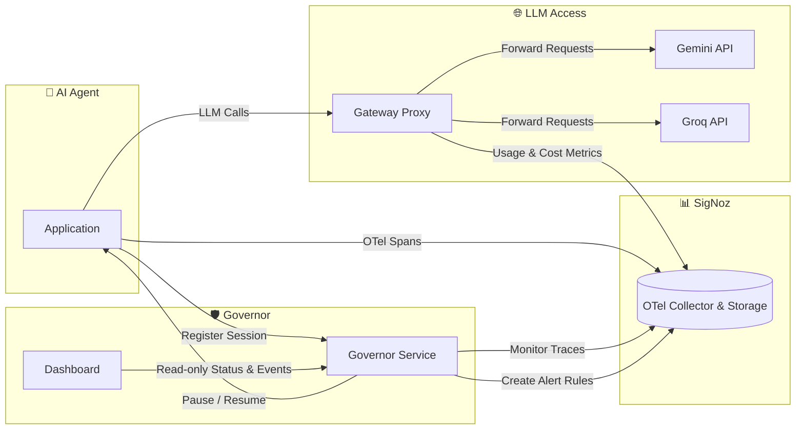

## Signoz Governor

<div align="center">


<!-- ⚠️ placeholder: swap in a real banner/screenshot at docs/screenshots/banner.png -->

An agent observability system that doesn't just watch AI agents, it stops them when they trip or go wrong.

     

<!-- ⚠️ placeholder: swap in a real demo gif/screenshot at docs/screenshots/demo.gif -->


<em>An agent gets stuck in a loop → the Governor catches it mid-session → it's paused, with a real SigNoz alert to prove it.</em>

### ⚡ [**See it running → your-deployed-link-here**](http://13.206.229.130:3000/)

<!-- ⚠️ placeholder: swap in your actual EC2 dashboard link -->

**Built for the WeMakeDevs *"Agents of SigNoz"* hackathon.**

</div>

---

## The problem

Our experience with many observability tools has been good, but one problem 
persists across the board, alerts arrive after something has already went 
wrong and the damage is done. We took this opportunity to try and tackle this
issue using Signoz. Using the Governor, we aim to detect in real-time if anything
seems wrong and take action immediately mitigating the damages *(cost and token usage)* done.

We wanted something that acts, not just reports. Something that is **Proactive** 
not just **Reactive**. So this system watches an agent's real OpenTelemetry traces 
in SigNoz, recognizes a handful of specific failure patterns like 
- identical tool calls repeating
- consecutive failures
- cost climbing past a cap

and when it sees one, it actually pauses the agent mid-session, not after a human reads a dashboard and decides to intervene.

---

## How it's put together

Four services, one shared SigNoz instance as the single source of truth.
Nothing talks to anything else's private state, every piece of
information the Governor or the dashboard uses comes from a real query
against SigNoz, not from services calling each other directly. This eliminates
any sort of mismatch in the state of data throughout all the components.



- **`agent/`** — a small research-agent that does search → retrieve →
  reason, it acts as our local AI Agent instrumented with OpenTelemetry so every step is a real span.
  It also has a programmed set of failure modes (`loop`, `fail`, `costly`, `rogue`) so
  we can trigger each detector on demand to see how the governor behaves when
  faced with such situations instead of hoping a real failure occurs. `rogue`
  specifically fires a tool call carrying a well-documented prompt-injection
  pattern (see OWASP's LLM Top 10) — nothing actually gets sent anywhere, it's
  a mock, but it gives the Governor a realistic anomalous-tool-call to catch.
- **`governor/`** — the titular component that polls SigNoz every few seconds for each active
  session's spans, runs pattern detectors against them, and if something
  trips, calls back into the agent to pause it and creates a real SigNoz
  alert rule recording what happened and why.
- **`dashboard/`** — a Next.js app that shows session/event state in plain
  language (no session IDs or raw detector names up front, those are
  behind a "view advanced details" toggle), with dark/light mode and
  visual status badges. Reads only from the Governor's own API (never
  SigNoz or the agent directly — see `docs/API_CONTRACT.md` for why that
  boundary matters to us).
- **`gateway-proxy/`** — sits between the agent and the real LLM
  providers. It started out Gemini-only and now also supports Groq behind
  the same interface — switching providers is a one-line change in the
  agent, nothing else in the system needs to know or care which one is
  actually running. Every LLM call goes through it so token/cost numbers
  are accurate, including reasoning tokens Gemini bills for internally
  that don't show up in the visible prompt/completion counts (we measured
  this, see "Things we learned the hard way" below).

Full interface details, including exact request/response shapes for every
call between services, are in [`docs/API_CONTRACT.md`](docs/API_CONTRACT.md).

---

## What we used from SigNoz

- **Foundry** for the actual install (`casting.yaml` / `casting.yaml.lock`
  in this repo — see setup below).
- **The SigNoz MCP server**, enabled via the same casting file. We built
  `gateway-proxy/usage_agent.py`, a CLI tool that connects to it and lets
  you ask real natural-language questions about usage ("what did I spend
  on Gemini today") by calling SigNoz's own tools instead of us
  hand-rolling a query API. Wiring this same Q&A experience directly into
  the dashboard is on our roadmap, not shipped in this submission.
- **Query Builder** for the Governor's own span queries (span name,
  attributes like `gen_ai.tool.name` and `gen_ai.tool.call.arguments`,
  filtered by `session.id`).
- **Dashboards** for cost/token trend panels.
- **Alerts** — the Governor creates real SigNoz alert rules
  (`governor-{reason}-{sessionId}`) the moment it intervenes, so the
  intervention itself is a first-class, queryable event in SigNoz, not
  just a console log line.

  Please visit [Signoz](https://signoz.io/docs/install/) for any doubts you have regarding the installation and setup of Signoz for your projects.

---

## Prerequisites

- A Linux VM (we used Ubuntu 24.04 on EC2, t3.large — 4 vCPU / 8GB RAM,
  60GB disk was comfortable)
- Docker (see installation steps [here](https://docs.docker.com/engine/install/))
- Node.js 20+ (see installation steps [here](https://nodejs.org/en/download))
- Python 3.12+ (see installation steps [here](https://discuss.python.org/t/install-python-3-11-9-on-ubuntu/51093))
- A Gemini API key (create one for free [here](https://aistudio.google.com/api-keys))
- Optional: a Groq API key (create one for free [here](https://console.groq.com)) — the gateway proxy supports it as a second provider, no card required

## Setting it up from scratch

### 1. Install SigNoz via Foundry

```bash
curl -fsSL https://get.docker.com | sh
sudo usermod -aG docker $USER && newgrp docker
curl -fsSL https://signoz.io/foundry.sh | bash

#Git clone this repo and then perform following steps
cd signoz-governor 
foundryctl cast -f casting.yaml
docker ps  
```

Open `http://<your-host-ip>:8080` and create an admin account.

### 2. Create a SigNoz Service Account key (needed for MCP)

In the SigNoz UI: Settings → Service Accounts → create one (needs Admin
role). Save the key someplace safe (we recommend Notion Doc) you'll need it for the usage-query agent later.

### 3. Gateway proxy

```bash
cd gateway-proxy
python3 -m venv venv && source venv/bin/activate
pip install -r requirements.txt
cp .env.example .env   # fill in GEMINI_API_KEY and OTEL_EXPORTER_OTLP_ENDPOINT
                        # (optionally GROQ_API_KEY too, if you want the second provider)
set -a; source .env; set +a
python -m uvicorn app.main:app --host 0.0.0.0 --port 9000
```

### 4. Governor

```bash
cd governor
cp .env.example .env   # fill in whatever it asks for
npm install
npm start   # listens on :4001, polls every 5s by default
```

### 5. Agent

```bash
cd agent
cp .env.example .env
npm install
export PROXY_BASE=http://localhost:9000
node --import ./src/instrumentation.js src/index.js   # listens on :3500
```

The agent runs one real "proof of life" session automatically on startup
which is one real Gemini API call, worth remembering if you're watching
your quota closely. We were very careful with our API Calls as we were using the free API Key available in Google AI Studio.

### 6. Dashboard

```bash
cd dashboard
npm install
npm run dev   # http://localhost:3000
```

### The easy way: start everything with one command

We got tired of juggling five terminal panes ourselves, so there's now a
pm2 script that starts every non-Docker service (gateway proxy, governor,
agent, dashboard) from a single terminal:

```bash
npm install -g pm2
pm2 start ecosystem.config.js   # <- confirm this matches the actual file/command in this repo
pm2 logs                        # tail all services' output in one place
pm2 stop all                    # when you're done
```

This is what we now use day to day. The per-service steps below still
work exactly as documented, and are worth knowing if you want to run just
one service on its own or debug something in isolation.

### The manual way, one terminal per service

All four non-Docker services below are long-running processes with
console output you'll want to keep watching. If you're not using the pm2
script above, run them inside `tmux` (or `screen`) rather than plain SSH
sessions — a dropped connection otherwise kills the process or, worse,
leaves it running with no way to see its logs. (We learned this one the
hard way too, more than once — see below.)

## Ports

| Service | Port |
|---|---|
| SigNoz UI | 8080 |
| SigNoz OTLP ingest | 4317 (gRPC), 4318 (HTTP) |
| SigNoz MCP server | 8000 |
| Gateway proxy | 9000 |
| Governor | 4001 |
| Agent (control endpoints) | 3500 |
| Dashboard | 3000 |

## Verifying it actually works

Send one real request through the proxy and confirm it lands in SigNoz:

```bash
cd gateway-proxy
python test_groq.py http://localhost:9000 #put a prompt in the test file as you would in a real AI Agent and wait for its response
```

Check SigNoz → Traces for a `gen_ai.chat` span, service `ai-gateway-proxy`.

Trigger a stuck-loop scenario (this one's free, it only calls a local
mock tool, no real API cost) and watch the Governor catch it:

```bash
curl -s -X POST http://localhost:3500/run \
  -H "Content-Type: application/json" \
  -d '{"task": "test loop", "mode": "loop"}' &

curl -s http://localhost:4001/governor/status | python3 -m json.tool
```

Within a few polling cycles, the session should flip to `"tripped": true`,
the agent's own response should report
`"outcome": "paused_by_governor"`, and a new alert rule named
`governor-loop_detected-<sessionId>` should appear in SigNoz's Alerts tab.

---

## Things we learned the hard way

- **Reasoning tokens are invisible unless you go looking for them.**
  Gemini's `usage.total_tokens` can run several times higher than
  `prompt_tokens + completion_tokens` when the model reasons internally
  that gap is real spend that a naive tracker (including our own first
  draft) silently drops. The proxy now reads `total_tokens` directly
  instead of assuming it equals the sum of the two visible fields.
- **Pin model names loosely, not tightly.** Several specific Gemini model
  IDs 404'd or lost free-tier access entirely partway through building
  this. We standardized on the `gemini-flash-latest` alias everywhere
  instead of a fixed version string. Don't be discouraged when you hit such 404 errors, it doesn't mean your application is not working, it probably means your chosen Gemini
  model is not free tier or you've exhuasted your daily free API Calls.
- **Free-tier quotas are daily, not per-minute**, and pro-tier models
  currently have zero free allowance at all (not "limited" staright-up zero).
  Worth enabling billing before a live demo rather than finding this out
  mid-presentation.
- **Env vars loaded in one terminal don't exist in another.** We lost real
  time to `.env` values not making it into the actual running process,
  because we'd load them in the terminal we were testing from, not the
  one that had actually started the server. Fixed properly now — the
  proxy loads its own `.env` on startup instead of trusting the shell to
  have exported anything, so this class of bug shouldn't come back. If
  you're not using the pm2 script, this is exactly the kind of thing it
  quietly protects you from.
- **A new provider needs a pricing entry, or cost silently reports as
  zero.** When we added Groq, we forgot for a bit to add its per-token
  price to the proxy's pricing table — no error, no warning, just $0 on
  every dashboard panel. If you add a new model, check it actually has an
  entry in `gateway-proxy/app/config.py`'s `PRICING` dict before trusting
  any cost number you see.

## AI assistant disclosure

Parts of this project — architecture planning, debugging, boilerplate
code generation were built with help from Claude
(Anthropic), used throughout development alongside our own design
decisions and testing.

## Team

*Built by Anurag Kumar and Wasim Khan for the "AI & Agent Observability"
track.*

